# Recapping My SQL Journey with SQLite
By CJ (Bangkok, Thailand)

### 👋 Short Introduction:   
Hi everyone! I'm CJ from Bangkok, Thailand.  
This post is part of my learning journey
The purpose of this post is to recap and reinforce my SQL knowledge.   
Personally, I find that taking notes and sharing them is one of the best ways to review and reflect, so that's how this post came !!  
So… shall we start?

### Topic: Introduction to SQLite

- Learning tool: https://sqliteonline.com
- Sample .db file: 📦 [Download Sample .db File](https://github.com/ChanikaJan/Learning_SQL/blob/main/Thailand_adminboundaries.db)
 (Thailand administrative boundaries + area data)

## 🛠️ Getting Started
1. Go to 👉 sqliteonline.com

         
2. Click File >> Open DB and upload your sample .db file.

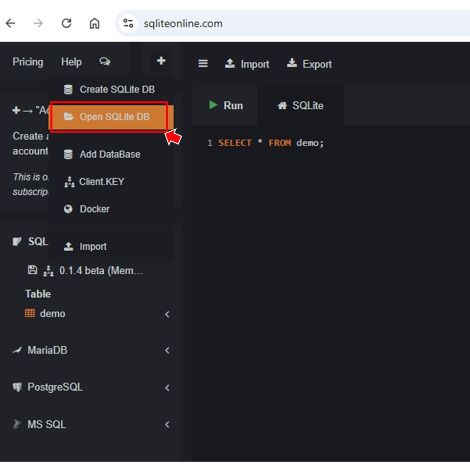

3. Once uploaded, the table will appear with columns like:     

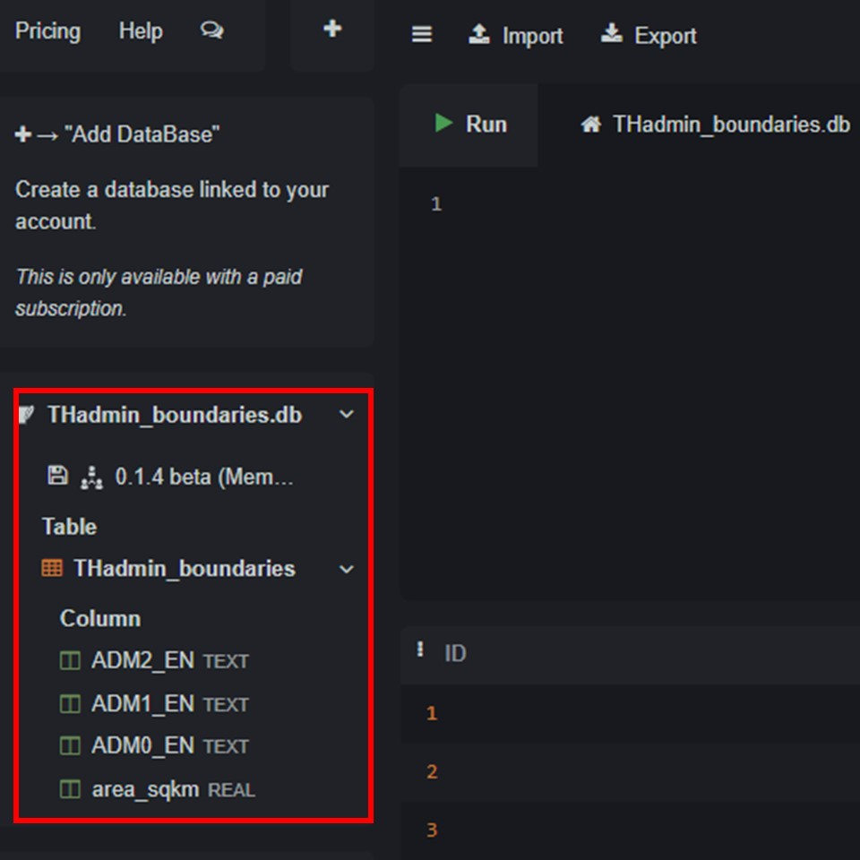

**💡Explanation:**    
    ADM0_EN - (Country)  
    ADM1_EN - (Province)  
    ADM2_EN - (District)  
    area_sqkm - (Area in square kilometers)  

## Basic SQL Queries in SQLite Online 💻  
###  1. View All Records    

    
    SELECT * FROM Thailand_adminboundaries;    

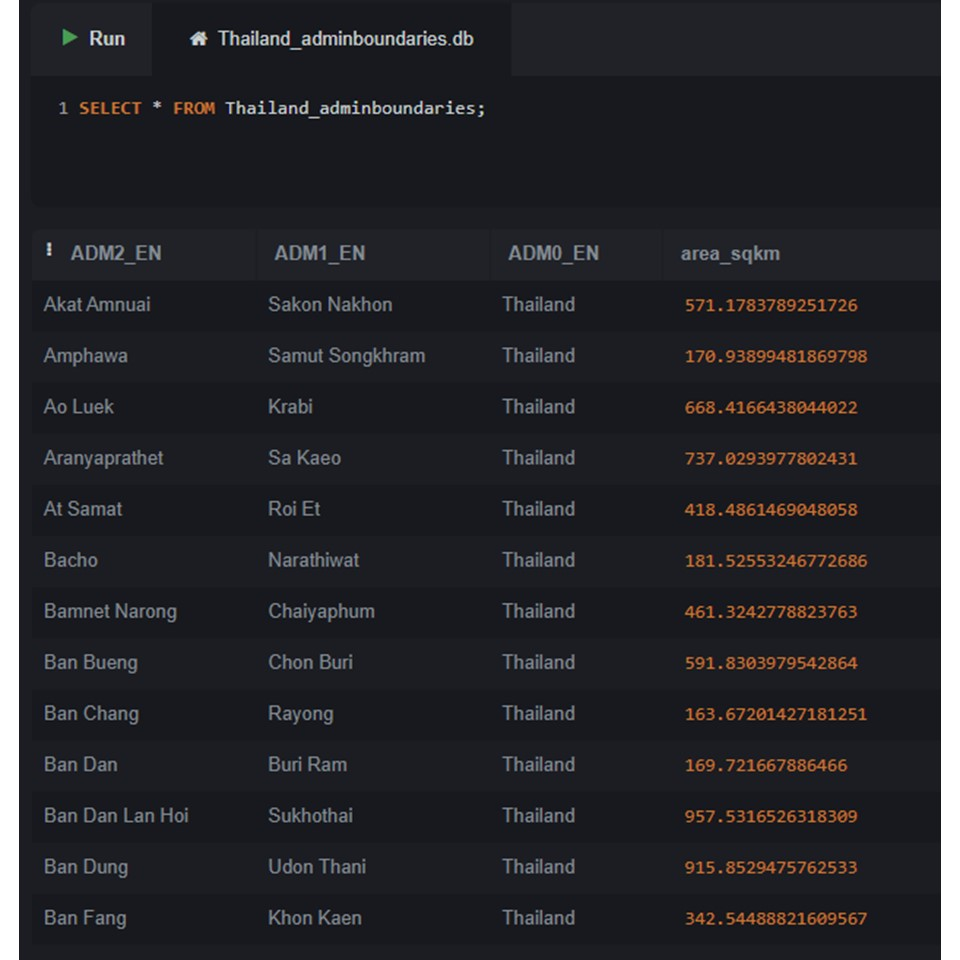

**💡Explanation:**   
* `SELECT *` tells SQL to show all columns.
* FROM Thailand_adminboundaries means we want the data from this specific table.  
* Use this to preview all the data inside the table.  

  
### 2. View the First 10 Rows

    
    SELECT * FROM Thailand_adminboundaries  
    LIMIT 10;  

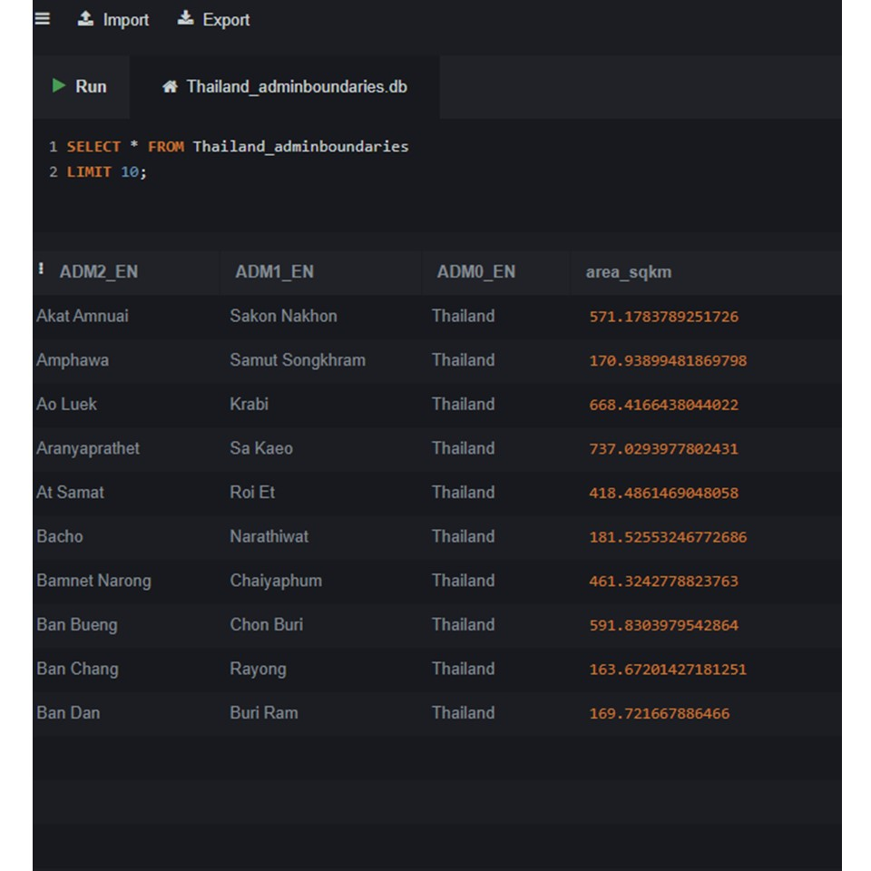
    
**💡Explanation:**     
* `LIMIT 10` shows only the first 10 rows of the table.    

### 3. Total Area by Province

    SELECT ADM1_EN AS province, 
       SUM(area_sqkm) AS total_area_sqkm
    FROM Thailand_adminboundaries
    GROUP BY ADM1_EN
    ORDER BY total_area_sqkm DESC;

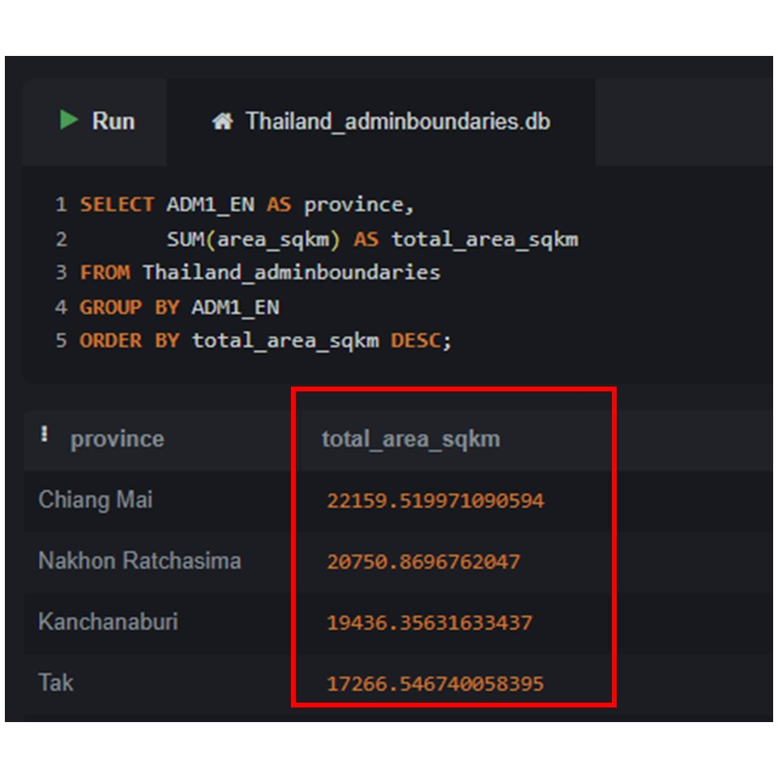

**💡Explanation:**     
* `ADM1_EN AS province`: rename this column as province in the result.  
* `SUM(area_sqkm)`: add up all the area values per province.  
* `GROUP BY ADM1_EN`: group the rows by province to calculate per-province totals.  
* `ORDER BY total_area_sqkm DESC`: sort from largest to smallest area.  
* `DESC` means descending order — from largest to smallest.  

### 3.1 Rounded to 2 Decimal Places 

    SELECT ADM1_EN AS province, 
           ROUND(SUM(area_sqkm), 2) AS total_area_sqkm
    FROM Thailand_adminboundaries
    GROUP BY ADM1_EN
    ORDER BY total_area_sqkm DESC;

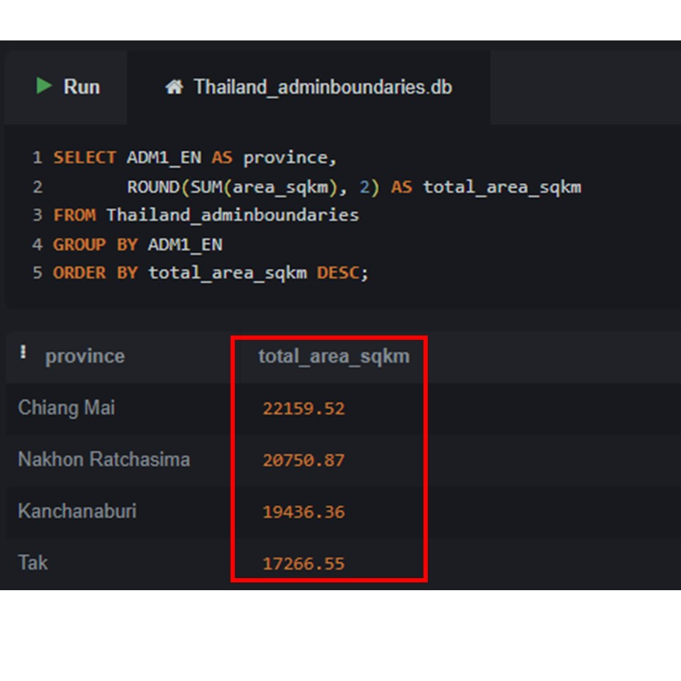  

**💡Explanation:**    
* `ROUND(..., 2)`: Rounds the total area to 2 decimal places (e.g., 1234.5678 → 1234.57).  

### 4. Total Area by District

    SELECT ADM1_EN AS province,
          ADM2_EN AS district,
          ROUND(area_sqkm, 2) AS area_sqkm_district
    FROM Thailand_adminboundaries
    ORDER BY ADM1_EN;

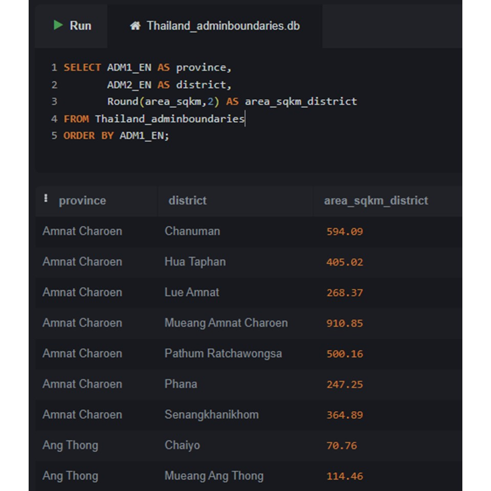  

**💡Explanation:**    
* Selects each district’s area with the related province.  
* `ORDER BY ADM1_EN`: Sorts the results alphabetically by province name  

### 5. Show District Areas (Rounded) in One Province Only

    SELECT ADM1_EN AS province,
           ADM2_EN AS district,
           ROUND(area_sqkm, 2) AS area_sqkm_district
    FROM Thailand_adminboundaries
    WHERE ADM1_EN = 'Tak'
    ORDER BY area_sqkm_district DESC;

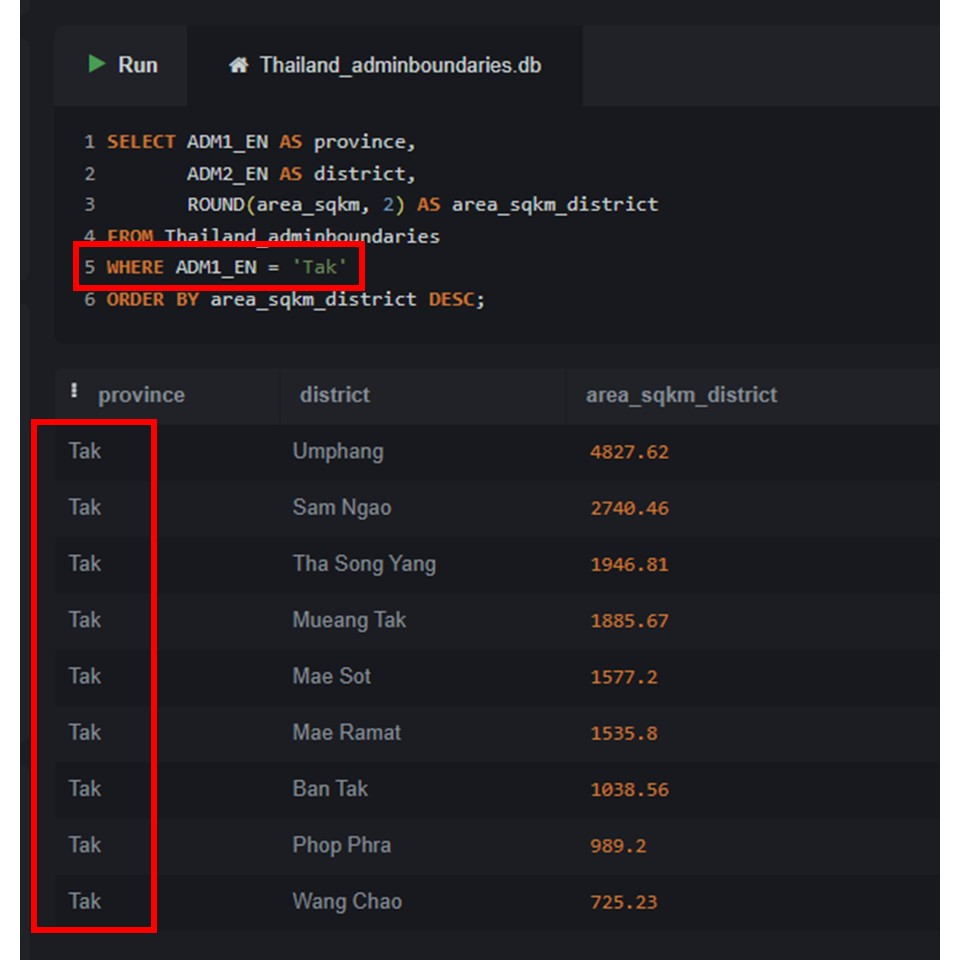  

**💡Explanation:**  
* `WHERE ADM1_EN = 'Tak'`:
* This filters the results to only include rows where the province is Tak. You can change 'Tak' to any other province name.

### 6.  Count Districts in Each Province

    SELECT ADM1_EN AS province,
           COUNT(ADM2_EN) AS district_count
    FROM Thailand_adminboundaries
    GROUP BY ADM1_EN
    ORDER BY district_count DESC;

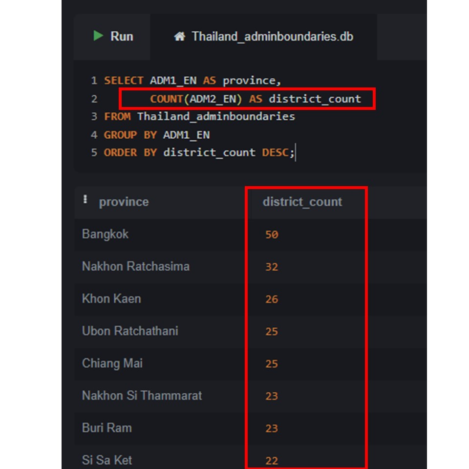  

**💡Explanation:**    
* `COUNT(ADM2_EN)`: counts the number of districts per province.  

### 7. Top 10 Largest Districts in Thailand

    SELECT ADM1_EN AS province,
           ADM2_EN AS district,
           area_sqkm
    FROM Thailand_adminboundaries
    ORDER BY area_sqkm DESC
    LIMIT 10;

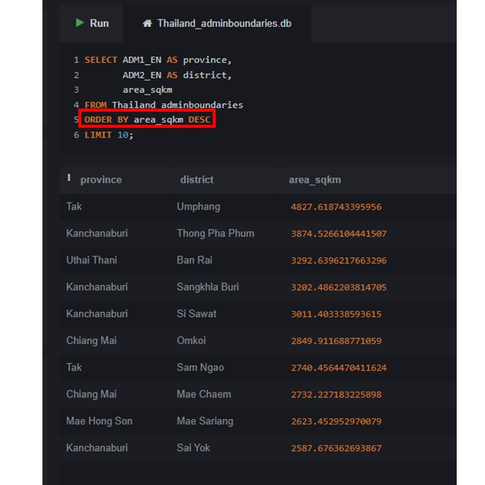  

**💡Explanation:**
* Selects the top 10 largest districts by area in the entire country.

### 8. Calculate Total Area of Thailand

    SELECT SUM(area_sqkm) AS total_area_thailand
    FROM Thailand_adminboundaries;

**💡Explanation:**
 * `SUM(area_sqkm)`: adds up all area values in the dataset.  
 * This gives you the total land area of Thailand.  

### 9. Count Total Number of Provinces

    SELECT COUNT(DISTINCT ADM1_EN) AS total_province_count
    FROM Thailand_adminboundaries;

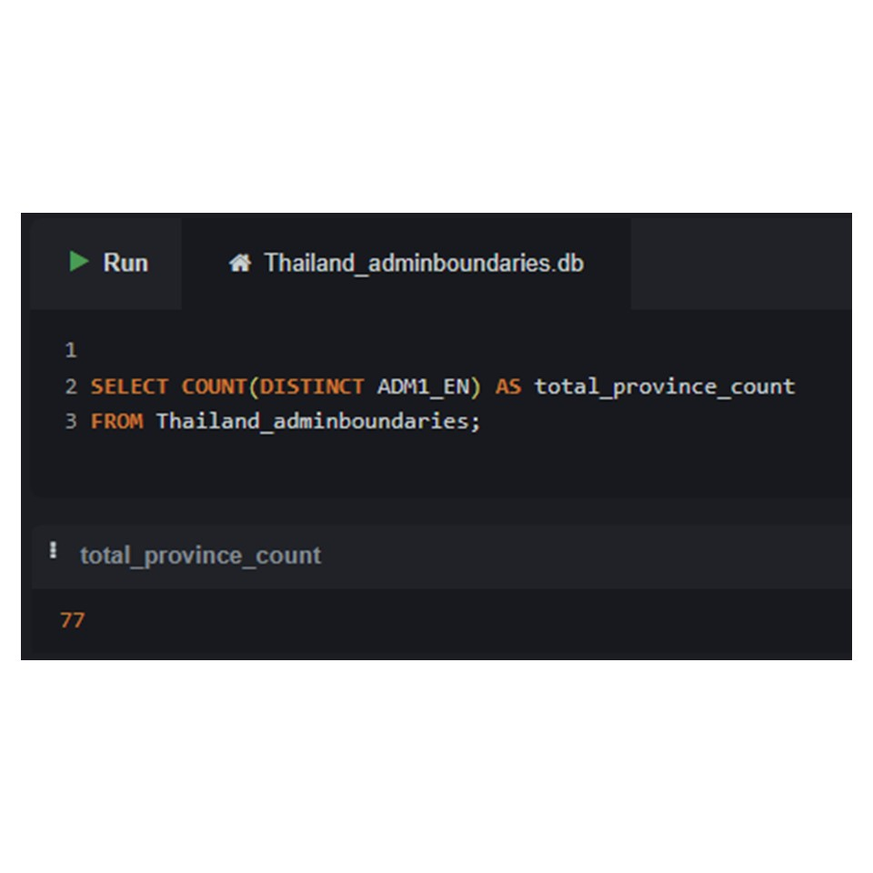  

**💡Explanation:**
* `COUNT(...)`: Counts the number of records.  
* `DISTINCT ADM1_EN`: Ensures each province is counted only once, even if it appears in many rows (due to districts).  

### 10. Exporting: You can export the results to a CSV or Excel file by clicking the Export button.

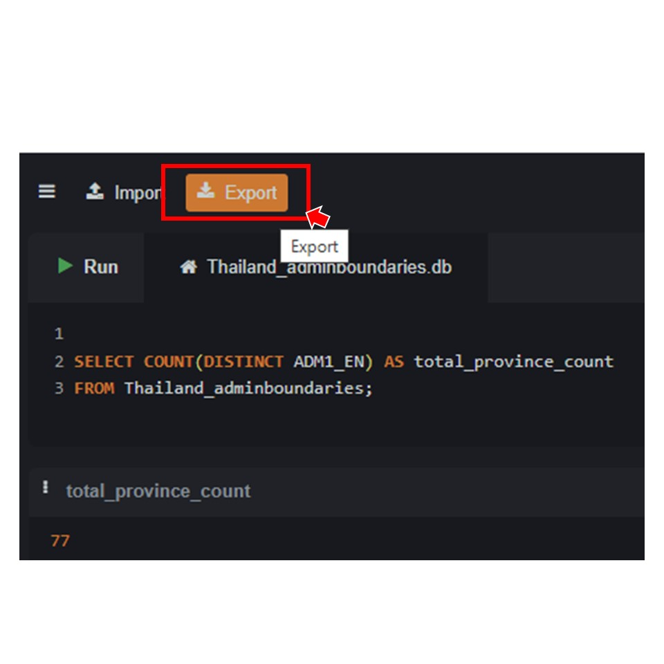

### Final Thoughts 💬  
Thanks for reading!  
If you found this helpful, feel free to ⭐ the repo or leave a comment.  
Let’s keep learning and growing together! 🌱  

#### 📌Common SQL Aggregate Functions 
Function	- Description   
`MIN()`	    - Returns the smallest value in a column  
`MAX()`    	- Returns the largest value  
`COUNT()`	  - Counts number of rows  
`SUM()`	    - Adds all numeric values  
`AVG()`	    - Calculates the average  

#### 📌Some Essential SQL Commands  
`Command`	     - What It Does  
`SELECT`	      - Retrieves data from the database    
`INSERT`       - INTO	Adds new data    
`UPDATE`	      - Changes existing data    
`DELETE`	      - Removes data    
`CREATE TABLE`	- Creates a new table    
`DROP TABLE`	  - Deletes a table completely    
`CREATE INDEX`	- Adds an index for faster search    
`DROP INDEX`	  - Removes an index    

#### 📚 Keep Learning!  
Here are some beginner-friendly SQL learning resources:  
* W3Schools SQL Tutorial - https://www.w3schools.com/sql/  
* HarvardX, Introduction to Databases with SQL - https://pll.harvard.edu/course/cs50s-introduction-databases-sql

